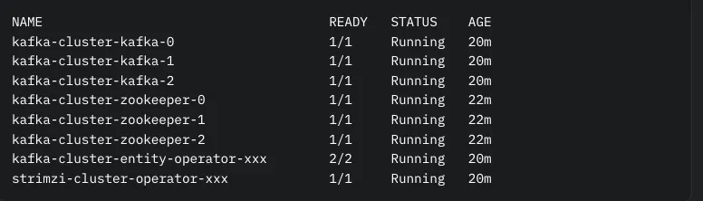

# kafka-meetup

Why Migrate Kafka Cluster to KRaft?

Switching Kafka Cluster to KRaft brings:
No ZooKeeper: Fewer components, easier management.
Improved scalability: KRaft handles metadata for larger clusters efficiently.
Future-ready: Aligns with Kafka’s ZooKeeper-free roadmap.
Strimzi streamlines the migration, requiring just a few annotation changes to transform Kafka Cluster into a KRaft-based system

Before You Start
Ensure Kafka Cluster is ready for migration:
Strimzi version: Use 0.40.0 or later (supports KRaft migration).
Kafka version: Use 3.7.0 or higher for full KRaft compatibility.
Node pools: Kafka Cluster must use KafkaNodePool resources for brokers.
Backups: Save all topics, messages, and configurations.
Test environment: Practice on a staging cluster first.
Downtime planning: Schedule during a low-traffic period.

How Strimzi Simplifies Migration

Strimzi uses the strimzi.io/kraft annotation on the Kafka cluster Kafka resource to control the migration. The annotation supports four values:
disabled: ZooKeeper-based cluster.
migration: Initiates the migration to KRaft.
enabled: Finalizes the migration to KRaft.
The migration transitions Kafka Cluster through states like ZooKeeper, KRaftMigration, KRaftDualWriting, and KRaftPostMigration, with Strimzi automating configurations and rolling updates.